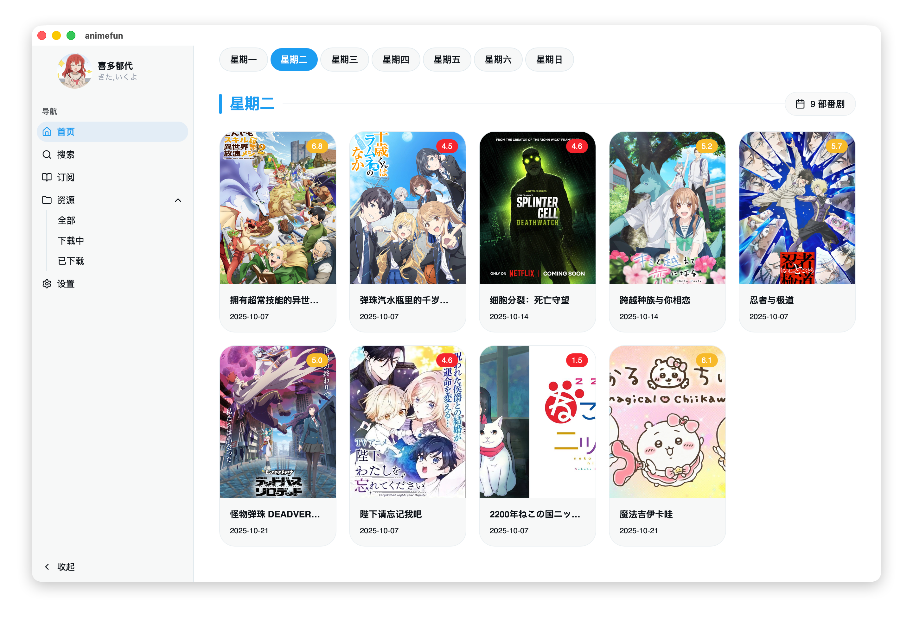
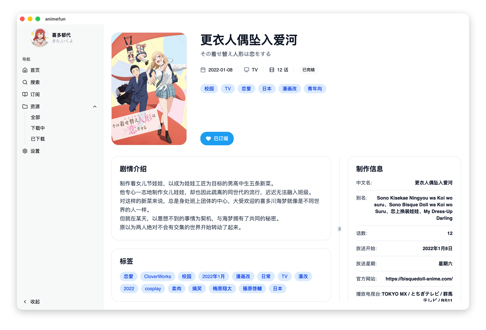
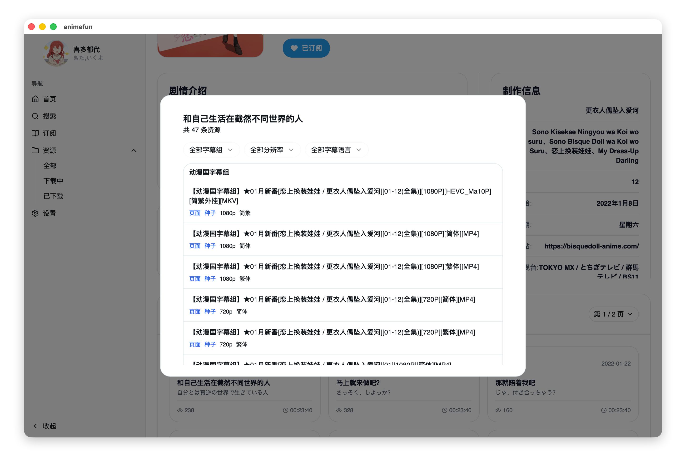
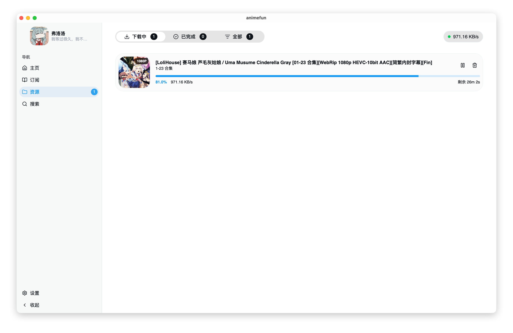
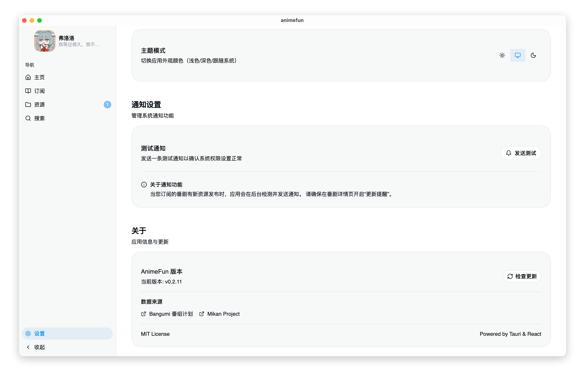

<div align="center">
  <a href="https://github.com/Niloux/animefun">
    
  </a>

# AnimeFun

**极客的番剧订阅管理器**

_订阅一次 · 自动追番 · 本地优先_

  <p align="center">
    <a href="https://github.com/Niloux/animefun/releases">
      
    </a>
    <a href="https://github.com/Niloux/animefun/releases">
      
    </a>
    <a href="https://github.com/Niloux/animefun/stargazers">
      
    </a>
    <a href="LICENSE">
      
    </a>
  </p>
  
  <p align="center">
    
    
    
  </p>
</div>

<br/>

## ✨ 为什么用 AnimeFun?

**传统追番**: 每天手动打开 Bangumi → 记住放送时间 → 搜索下载 → 添加到 BT 客户端

**用 AnimeFun**: 订阅一次 → 自动检查更新 → 一键推送下载

- 🔄 **自动追番** — 后台自动检查更新，新番上线第一时间通知
- 📅 **本周看什么** — 日历视图一目了然，不再错过放送
- ⚡ **一键下载** — 看到想要的番，一键推送到本地 BT 客户端
- 🔍 **智能筛选** — 按评分/类型/年份快速找到好番
- 🎁 **资源聚合** — 自动整合番剧信息和下载来源
- ✈️ **离线可用** — 图片缓存本地，网络断开也能浏览
- 🔒 **隐私优先** — 所有数据存储本地，不上云端

---

## 📸 界面预览

<div align="center">
  <table>
    <tr>
      <td width="50%" align="center">
        
        <br/><b>🏠 首页 - 快速浏览订阅</b>
      </td>
      <td width="50%" align="center">
        
        <br/><b>📋 订阅管理 - 自动同步更新</b>
      </td>
    </tr>
    <tr>
      <td align="center">
        
        <br/><b>🎬 番剧详情 - 资源一键推送</b>
      </td>
      <td align="center">
        
        <br/><b>📦 资源管理 - 查看所有剧集</b>
      </td>
    </tr>
    <tr>
      <td align="center">
        
        <br/><b>⬇️ 下载管理 - 实时监控任务</b>
      </td>
      <td align="center">
        
        <br/><b>⚙️ 设置界面 - 客户端一键配置</b>
      </td>
    </tr>
  </table>
</div>

---

## 📥 快速开始

### 安装

下载 [Releases](https://github.com/Niloux/animefun/releases) 中的安装包：

| 平台    | 文件格式                      |
| ------- | ----------------------------- |
| macOS   | `.dmg` / `.app.tar.gz`        |
| Linux   | `.AppImage` / `.deb` / `.rpm` |
| Windows | `.msi` / `.nsis.exe`          |

### 配置

1. 打开软件，进入设置页面
2. 配置 BT 客户端地址（qBittorrent/Transmission）
   - _提示：需开启 BT 客户端的 WebUI 功能_
3. 搜索番剧，点击订阅

---

## 💻 开发指南

**前置要求**：

- Node.js 18+
- pnpm (`npm i -g pnpm`)
- Rust 工具链 (rustup.rs)
- 平台依赖：见 [Tauri 官方文档](https://tauri.app/v2/guides/prerequisites/)

```bash
git clone https://github.com/Niloux/animefun.git
cd animefun
pnpm install
pnpm tauri dev      # 启动开发环境
pnpm lint           # ESLint
pnpm format         # Prettier
pnpm types:gen      # 从 Rust 导出 TypeScript 类型
pnpm tauri build    # 构建生产版本
```

---

## 🛠️ 技术实现

- **跨平台**：Tauri 2 + Rust（比 Electron 轻量 5 倍）
- **数据源**：[Bangumi API](https://github.com/bangumi/api)（番剧信息）+ [Mikan Project](https://mikanani.me)（下载资源）
- **本地优先**：SQLite 存储，图片缓存，离线可用
- **类型安全**：ts-rs 自动同步 Rust ↔ TypeScript 类型

### 核心技术栈

<div align="center">


</div>

---

## 📂 数据存储

| 平台    | 目录                                                |
| ------- | --------------------------------------------------- |
| macOS   | `~/Library/Application Support/com.wuyou.animefun/` |
| Linux   | `~/.config/com.wuyou.animefun/`                     |
| Windows | `%APPDATA%\com.wuyou.animefun\`                     |

所有数据仅存储在本地，网络请求仅限于 Bangumi 公开 API 与公开 RSS 数据源。

---

## ⚖️ 免责声明

**本项目 AnimeFun 严格遵守相关法律法规，仅供学习交流与个人研究使用。**

1. **本项目不提供、不存储、不分发任何受版权保护的内容**（包括但不限于视频、音频、图像等文件）。

2. 所有番剧元数据（封面、简介、评分等）均来源于 [Bangumi API](https://github.com/bangumi/api)，其版权归原权利人所有。

3. 本项目支持调用本地已安装的 BT 客户端（如 qBittorrent、Transmission），但：

   - 本项目不提供任何下载链接或资源地址
   - 用户需自行配置 RSS 数据源
   - 任何下载行为均由用户自行决定并承担责任

4. **本项目禁止用于任何商业用途**。

如有权利人认为本项目内容侵犯了您的合法权益，请通过 [Issue](https://github.com/Niloux/animefun/issues) 联系，项目维护者将在核实后及时处理。

---

<p align="center">
  Made with ❤️ by <a href="https://github.com/Niloux">Niloux</a>
</p>

## 📄 许可证

[MIT](LICENSE) © Niloux
