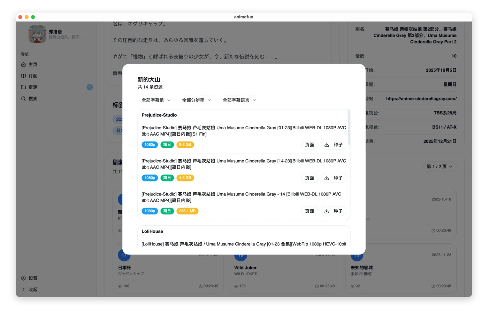
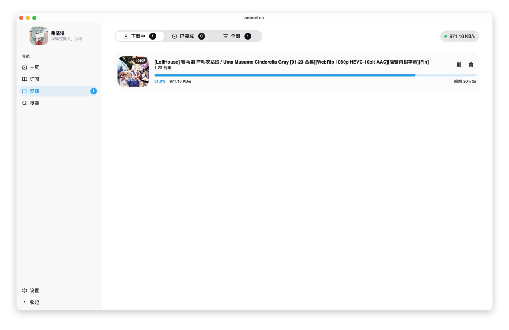
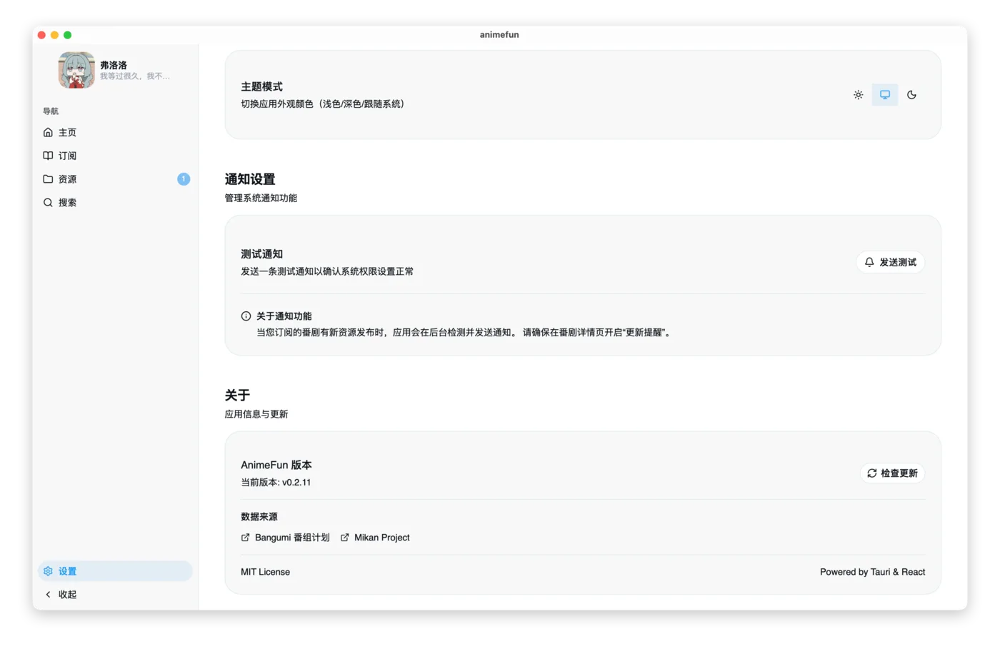

# AnimeFun

本地优先的跨平台追番助手。订阅 Bangumi 番剧，匹配 Mikan RSS 资源，并推送到 qBittorrent Web UI。

<p>
  <a href="https://github.com/Niloux/animefun/releases">
    
  </a>
  <a href="https://github.com/Niloux/animefun/actions/workflows/tauri-build.yml">
    
  </a>
  <a href="LICENSE">
    
  </a>
</p>

<p>
  
</p>

## 它解决什么问题

传统追番流程很碎：记放送时间，打开多个站点，手动找资源，再切到 BT 客户端添加任务。AnimeFun 把这些动作收进一个本地桌面应用里。

| 你要做的事 | AnimeFun 的处理方式           |
| ---------- | ----------------------------- |
| 看本周更新 | 用星期视图展示每日番剧        |
| 跟踪番剧   | 订阅后在本地保存状态          |
| 找资源     | 根据番剧信息匹配 Mikan RSS    |
| 添加下载   | 推送到本地 qBittorrent Web UI |
| 离线浏览   | 缓存图片和应用数据到本机      |

## 功能

- **番剧订阅**：搜索 Bangumi 条目，把想看的番剧加入订阅。
- **放送日历**：按星期查看更新，不靠记忆追进度。
- **资源匹配**：从 Mikan RSS 聚合可用资源，按集数查看。
- **下载管理**：连接 qBittorrent Web UI，添加任务并查看下载状态。
- **本地优先**：应用数据和图片缓存保存在本机，不依赖云端账号。

## 界面预览

<details>
<summary>查看更多截图</summary>

<table>
  <tr>
    <td width="50%">
      
      <br>
      <strong>订阅管理</strong>
    </td>
    <td width="50%">
      
      <br>
      <strong>番剧详情</strong>
    </td>
  </tr>
  <tr>
    <td width="50%">
      
      <br>
      <strong>资源列表</strong>
    </td>
    <td width="50%">
      
      <br>
      <strong>下载管理</strong>
    </td>
  </tr>
  <tr>
    <td colspan="2">
      
      <br>
      <strong>设置</strong>
    </td>
  </tr>
</table>

</details>

## 快速开始

### 安装

从 [Releases](https://github.com/Niloux/animefun/releases) 下载当前平台的安装包。发布资产以 Release 页面实际文件为准。

当前自动发布流程覆盖：

| 平台    | 架构          |
| ------- | ------------- |
| macOS   | Apple Silicon |
| Windows | x64           |

Linux 可以从源码构建，Tauri 的系统依赖请参考 [官方前置要求](https://tauri.app/v2/guides/prerequisites/)。

### 配置 qBittorrent

1. 启动 qBittorrent。
2. 在 qBittorrent 中启用 Web UI。
3. 打开 AnimeFun 的设置页，保存 qBittorrent Web UI 地址和账号信息。
4. 搜索番剧并订阅，在番剧详情页查看资源和添加下载。

## 开发

### 前置要求

- Node.js 20+
- pnpm
- Rust 工具链
- Tauri 平台依赖

### 常用命令

```bash
git clone https://github.com/Niloux/animefun.git
cd animefun
pnpm install
pnpm tauri dev
```

```bash
pnpm build       # 构建前端
pnpm lint        # ESLint
pnpm format      # Prettier
pnpm types:gen   # 从 Rust 模型生成 TypeScript 类型
pnpm tauri build # 构建桌面应用
```

## 技术栈

| 层         | 技术                                  |
| ---------- | ------------------------------------- |
| 桌面运行时 | Tauri 2, Rust                         |
| 前端       | React 19, TypeScript, Tailwind CSS v4 |
| UI 基础    | Radix UI, lucide-react                |
| 数据获取   | Bangumi API, Mikan RSS                |
| 本地存储   | SQLite, 文件缓存                      |
| 类型同步   | ts-rs                                 |

## 数据与隐私

AnimeFun 不需要云端账号。应用配置、订阅状态、下载记录和图片缓存都保存在本机。

| 平台    | 数据目录                                            |
| ------- | --------------------------------------------------- |
| macOS   | `~/Library/Application Support/com.wuyou.animefun/` |
| Linux   | `~/.config/com.wuyou.animefun/`                     |
| Windows | `%APPDATA%\com.wuyou.animefun\`                     |

网络请求用于访问 Bangumi 公开 API、Mikan RSS，以及你在设置中配置的 qBittorrent Web UI。

## 免责声明

AnimeFun 是开源桌面工具。MIT 许可证只覆盖本项目代码，不代表对第三方内容授予任何权利。

- 本项目不提供、不存储、不分发任何受版权保护的视频、音频或图像文件。
- 番剧元数据来源于 [Bangumi API](https://github.com/bangumi/api)，相关权利归原权利人所有。
- 资源匹配基于公开 RSS 数据。用户需要自行确认数据源和下载行为符合法律法规。
- 下载任务由用户配置的 qBittorrent 客户端执行，相关行为由用户自行负责。

如有权利人认为本项目内容侵犯合法权益，请通过 [Issue](https://github.com/Niloux/animefun/issues) 联系维护者。

## 许可证

[MIT](LICENSE) © Niloux
